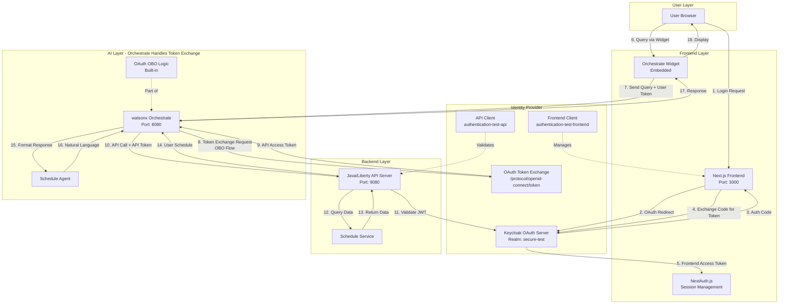
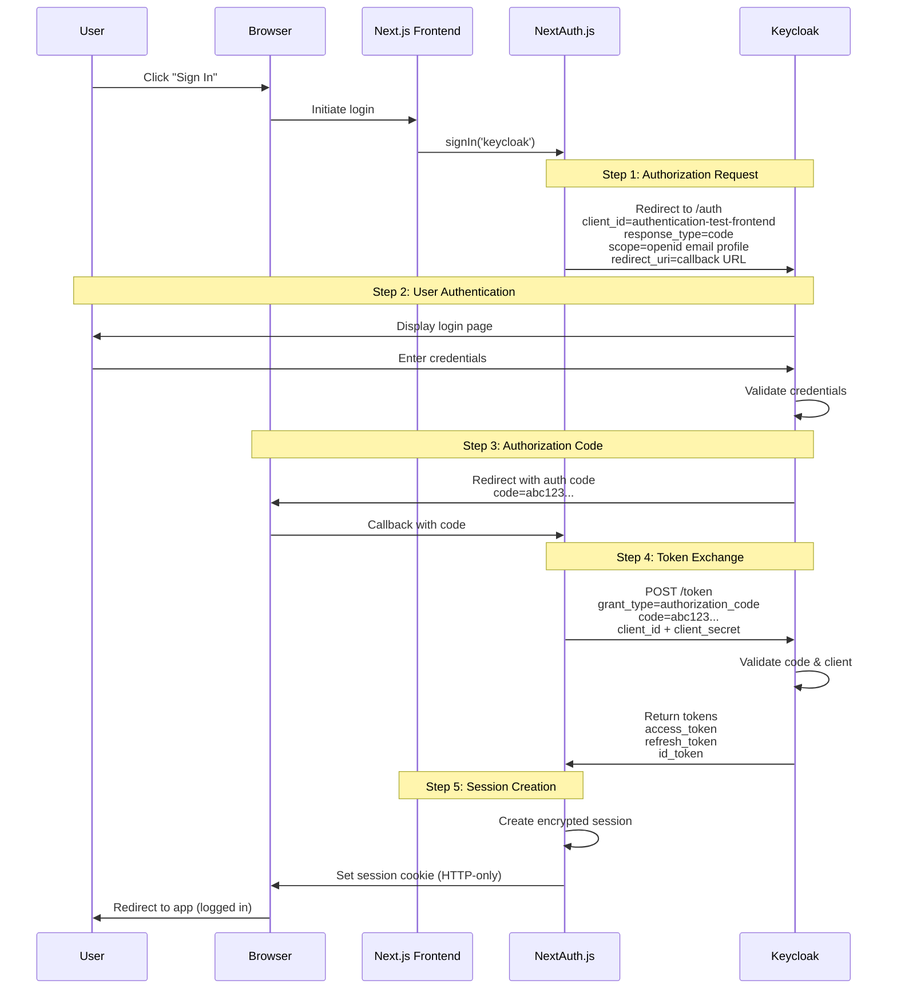
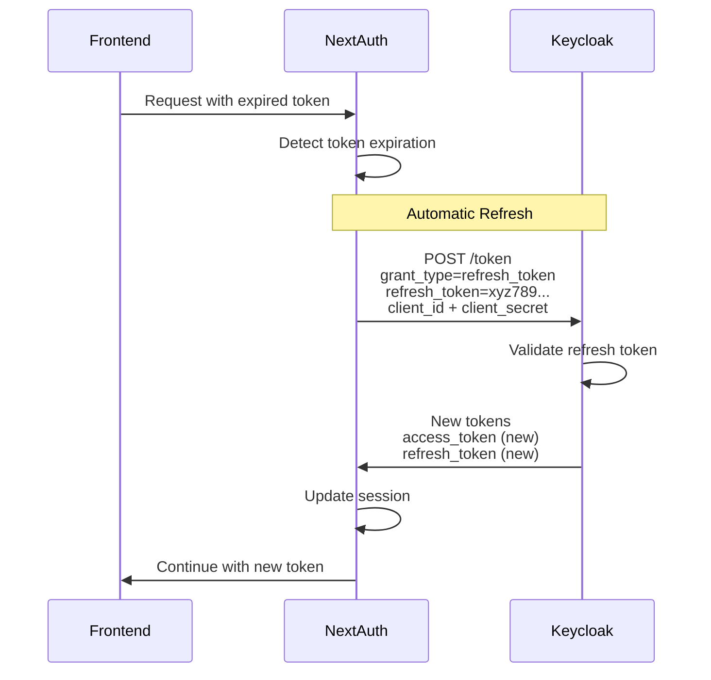
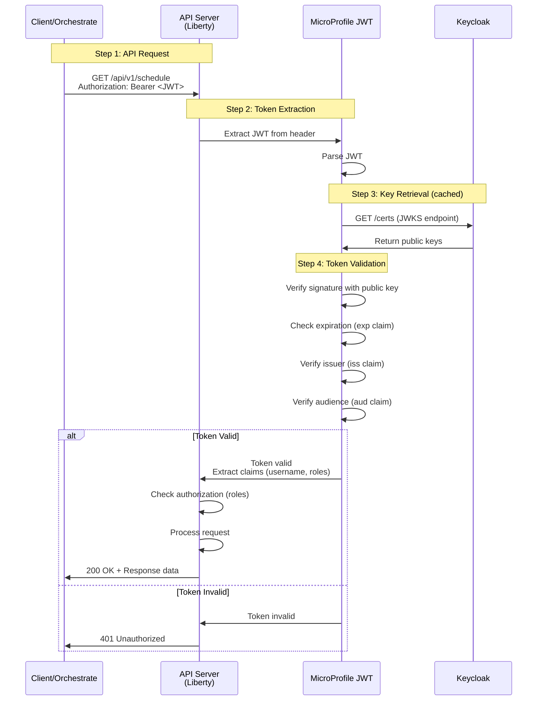
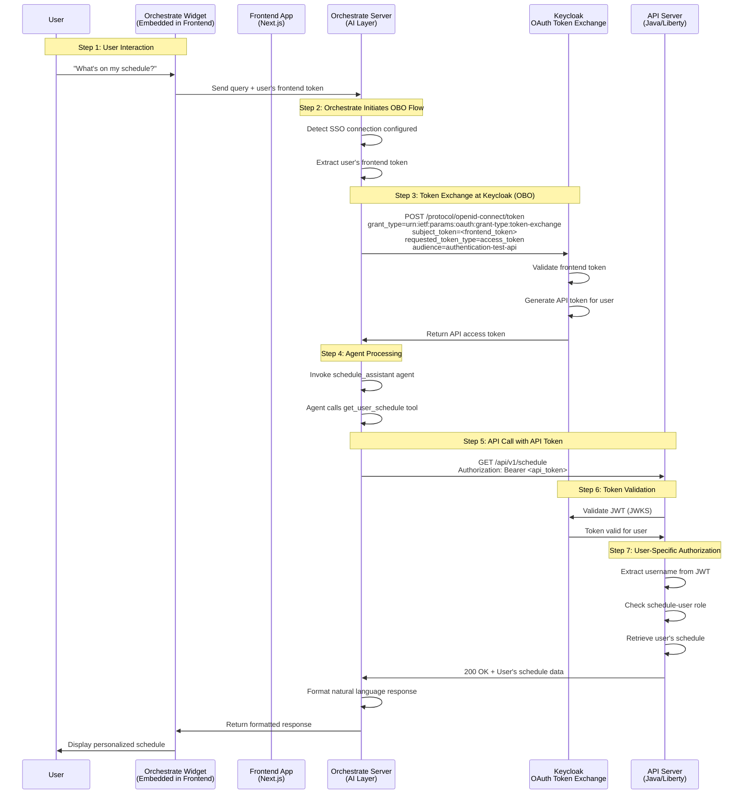
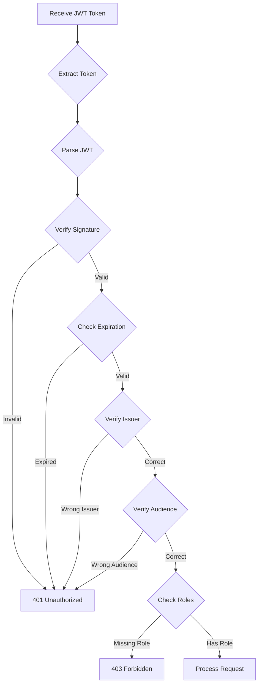
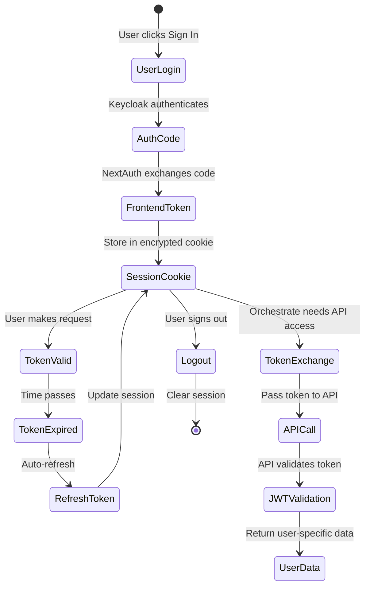

# OAuth 2.0 Authentication Flows

## Overview

This project implements a comprehensive OAuth 2.0 authentication architecture using Keycloak as the Identity Provider (IdP). The system supports two distinct authentication flows:

1. **Frontend Authentication** - Authorization Code Flow for user login
2. **API Server Authentication** - JWT Bearer Token validation for API access

Both flows work together to provide secure, user-specific access to resources while maintaining proper separation of concerns.

## System Architecture



## Keycloak's Role

Keycloak serves as the central **Identity Provider (IdP)** and **Authorization Server** for the entire system. It provides:

### Core Functions

1. **User Authentication**
   - Validates user credentials
   - Issues access tokens and refresh tokens
   - Manages user sessions

2. **Token Issuance**
   - Generates JWT tokens with user claims
   - Signs tokens with RSA keys
   - Includes user roles and groups

3. **Token Validation**
   - Provides JWKS endpoint for public key distribution
   - Validates token signatures
   - Verifies token expiration and audience

4. **Client Management**
   - Manages multiple OAuth clients (frontend, API)
   - Enforces client-specific security policies
   - Controls redirect URIs and scopes

5. **User Management**
   - Stores user credentials securely
   - Manages user roles and groups
   - Provides user profile information

### Keycloak Configuration

**Realm**: `secure-test`

**Clients**:
- `authentication-test-frontend` - Public client for web application
- `authentication-test-api` - Confidential client for API server

**Key Endpoints**:
- Authorization: `https://keycloak.otterburn.home/realms/secure-test/protocol/openid-connect/auth`
- Token: `https://keycloak.otterburn.home/realms/secure-test/protocol/openid-connect/token`
- JWKS: `https://keycloak.otterburn.home/realms/secure-test/protocol/openid-connect/certs`
- UserInfo: `https://keycloak.otterburn.home/realms/secure-test/protocol/openid-connect/userinfo`

## Flow 1: Frontend User Authentication

### Authorization Code Flow (OAuth 2.0)

The frontend uses the **Authorization Code Flow**, which is the most secure OAuth 2.0 flow for web applications.



### Token Structure

**Access Token** (JWT):
```json
{
  "exp": 1706659200,
  "iat": 1706655600,
  "jti": "a1b2c3d4-e5f6-7890-abcd-ef1234567890",
  "iss": "https://keycloak.otterburn.home/realms/secure-test",
  "aud": "authentication-test-frontend",
  "sub": "f47ac10b-58cc-4372-a567-0e02b2c3d479",
  "typ": "Bearer",
  "azp": "authentication-test-frontend",
  "session_state": "12345678-90ab-cdef-1234-567890abcdef",
  "scope": "openid email profile",
  "email_verified": true,
  "name": "Test User 2",
  "preferred_username": "testuser2",
  "given_name": "Test",
  "family_name": "User",
  "email": "testuser2@example.com"
}
```

### Token Refresh Flow

When the access token expires, NextAuth automatically refreshes it:



**Implementation** ([`Frontend/lib/auth.ts`](Frontend/lib/auth.ts:13-48)):
```typescript
async function refreshAccessToken(token: ExtendedJWT): Promise<ExtendedJWT> {
  const url = `${process.env.KEYCLOAK_ISSUER}/protocol/openid-connect/token`;
  
  const response = await fetch(url, {
    method: "POST",
    headers: { "Content-Type": "application/x-www-form-urlencoded" },
    body: new URLSearchParams({
      client_id: process.env.KEYCLOAK_CLIENT_ID!,
      client_secret: process.env.KEYCLOAK_CLIENT_SECRET!,
      grant_type: "refresh_token",
      refresh_token: token.refreshToken!,
    }),
  });

  const refreshedTokens = await response.json();
  
  return {
    ...token,
    accessToken: refreshedTokens.access_token,
    accessTokenExpires: Date.now() + refreshedTokens.expires_in * 1000,
    refreshToken: refreshedTokens.refresh_token ?? token.refreshToken,
  };
}
```

## Flow 2: API Server Authentication

### JWT Bearer Token Validation

The API server validates JWT tokens issued by Keycloak using the **MicroProfile JWT** specification.



### API Server Configuration

**Liberty server.xml** ([`API_server/src/main/liberty/config/server.xml`](API_server/src/main/liberty/config/server.xml:34-41)):
```xml
<mpJwt id="jwtConfig"
       jwksUri="${env.JWT_JWKS_URI}"
       issuer="${env.JWT_ISSUER}"
       audiences="authentication-test-api"
       groupNameAttribute="groups"
       userNameAttribute="preferred_username"
       sslRef="jwtSSLConfig"/>
```

**Environment Variables**:
```properties
JWT_JWKS_URI=https://keycloak.otterburn.home/realms/secure-test/protocol/openid-connect/certs
JWT_ISSUER=https://keycloak.otterburn.home/realms/secure-test
```

### Token Validation Process

1. **Signature Verification**
   - API server fetches public keys from Keycloak JWKS endpoint
   - Verifies JWT signature using RSA public key
   - Ensures token hasn't been tampered with

2. **Claims Validation**
   - **Issuer (`iss`)**: Must match configured Keycloak realm
   - **Audience (`aud`)**: Must be `authentication-test-api`
   - **Expiration (`exp`)**: Token must not be expired
   - **Not Before (`nbf`)**: Token must be valid now

3. **User Context Extraction**
   - **Username**: From `preferred_username` claim
   - **Roles**: From `groups` claim
   - **User ID**: From `sub` claim

## Flow 3: OAuth On-Behalf-Of (OBO) Token Exchange

### Orchestrate SSO Integration

When watsonx Orchestrate needs to call the API on behalf of the authenticated user, it uses the **OAuth 2.0 On-Behalf-Of (OBO) flow** with token exchange. This is similar to how Workday and other enterprise systems implement SSO.

**Key Concept**: Orchestrate obtains the user's frontend authentication token from the widget session, then directly calls Keycloak's OAuth token exchange endpoint to exchange the frontend token for an API-specific token. The frontend is not involved in the token exchange process.



### How OAuth On-Behalf-Of Works

The OBO flow enables Orchestrate to act on behalf of the authenticated user without requiring the user to re-authenticate:

1. **User Authentication**: User logs into the frontend via Keycloak (Authorization Code Flow)
2. **Session Establishment**: Frontend stores user's access token in encrypted session
3. **Widget Embedding**: Orchestrate widget is embedded in the frontend with user's session context
4. **Token Acquisition**: Widget passes user's frontend token to Orchestrate
5. **Token Exchange at Keycloak**: When Orchestrate needs to call the API:
   - Orchestrate extracts the user's frontend token
   - Orchestrate calls Keycloak's token exchange endpoint directly
   - Keycloak validates the frontend token
   - Keycloak issues a new API-specific token for the same user
   - Orchestrate receives the API token
6. **API Authorization**: Orchestrate calls API with the exchanged token, API validates and returns user-specific data

**Security Benefits**:
- ✅ User never shares credentials with Orchestrate
- ✅ Token is scoped to the authenticated user
- ✅ API sees the actual user identity (not a service account)
- ✅ Audit trail shows real user actions
- ✅ Token has limited lifetime (expires with session)
- ✅ Frontend is not involved in token exchange (separation of concerns)
- ✅ Keycloak controls token exchange policy centrally

### Keycloak Token Exchange

Orchestrate calls Keycloak's OAuth 2.0 Token Exchange endpoint (RFC 8693):

**Token Exchange Request**:
```http
POST /realms/secure-test/protocol/openid-connect/token
Content-Type: application/x-www-form-urlencoded

grant_type=urn:ietf:params:oauth:grant-type:token-exchange
&client_id=authentication-test-api
&client_secret=<api_client_secret>
&subject_token=<user_frontend_token>
&subject_token_type=urn:ietf:params:oauth:token-type:access_token
&requested_token_type=urn:ietf:params:oauth:token-type:access_token
&audience=authentication-test-api
```

**Token Exchange Response**:
```json
{
  "access_token": "eyJhbGc...",
  "issued_token_type": "urn:ietf:params:oauth:token-type:access_token",
  "token_type": "Bearer",
  "expires_in": 3600
}
```

The exchanged token:
- Has the same user identity (`sub`, `preferred_username`)
- Has audience `authentication-test-api` (not `authentication-test-frontend`)
- Can be validated by the API server
- Maintains user's roles and permissions

### Orchestrate Connection Configuration

The connection configuration consists of two parts:

#### 1. Connection YAML File

**Connection YAML** ([`orchestrate/schedule-api-connection.yaml`](orchestrate/schedule-api-connection.yaml:1)):

```yaml
spec_version: v1
kind: connection
app_id: schedule-api-connection
environments:
  draft:
    kind: oauth_auth_on_behalf_of_flow
    type: member
    sso: true  # Enables On-Behalf-Of flow
    server_url: http://localhost:9080  # API server endpoint
    idp_config:
      header:
        content-type: application/x-www-form-urlencoded
      body:
        requested_token_use: on_behalf_of
        requested_token_type: urn:ietf:params:oauth:token-type:access_token
    app_config:
      header:
        content-type: application/json
```

**Key Configuration Parameters**:
- `kind: oauth_auth_on_behalf_of_flow` - Specifies OAuth On-Behalf-Of flow (matches Workday SSO pattern)
- `sso: true` - Enables SSO/On-Behalf-Of mode
- `type: member` - Connection is per-user (not shared)
- `server_url` - The **API server endpoint** (where Orchestrate sends requests with the exchanged token)
- `idp_config` - Configuration for token exchange request format:
  - `requested_token_use: on_behalf_of` - Specifies OBO token exchange
  - `requested_token_type` - Type of token requested (access_token for JWT)
- `app_config` - Configuration for API server requests

#### 2. Identity Provider Configuration

The **token exchange server URL** and credentials are configured separately using the `set-identity-provider` CLI command:

```bash
orchestrate connections set-identity-provider \
  --app-id schedule-api-connection \
  --env draft \
  --url https://keycloak.otterburn.home/realms/secure-test/protocol/openid-connect/token \
  --client-id authentication-test-api \
  --client-secret 8u50V7iXkuibA4BvzKVoDcQ5aaAbUsTI \
  --scope openid \
  --grant-type urn:ietf:params:oauth:grant-type:jwt-bearer
```

**Identity Provider Parameters**:
- `--url` - The **Keycloak token exchange endpoint** (where Orchestrate exchanges tokens)
- `--client-id` - The API client ID in Keycloak (used to authenticate Orchestrate to Keycloak)
- `--client-secret` - The API client secret
- `--scope` - OAuth scopes to request
- `--grant-type` - The grant type for token exchange (JWT bearer for RFC 8693)

**Important**: The `idp_config.body` parameters in the YAML file are merged with the identity provider configuration to form the complete token exchange request.

#### Understanding the Two URLs

The OAuth On-Behalf-Of flow involves **two different server URLs**:

1. **Token Exchange Server URL** (Identity Provider)
   - **Configured via**: `set-identity-provider --url`
   - **Purpose**: Where Orchestrate exchanges the frontend token for an API token
   - **Example**: `https://keycloak.otterburn.home/realms/secure-test/protocol/openid-connect/token`
   - **Used for**: OAuth token exchange (RFC 8693)
   - **Authentication**: Orchestrate authenticates using `client_id` and `client_secret`

2. **API Server URL** (Application)
   - **Configured via**: Connection YAML `server_url`
   - **Purpose**: Where Orchestrate makes API calls with the exchanged token
   - **Example**: `http://localhost:9080`
   - **Used for**: Actual API requests (GET /api/v1/schedule)
   - **Authentication**: Bearer token (the exchanged API token)

**Flow Summary**:
```
User Token → [Token Exchange Server] → API Token → [API Server] → User Data
            (Keycloak)                            (Java/Liberty)
```

### Token Flow Comparison

| Aspect | Without OBO | With OBO (SSO) |
|--------|-------------|----------------|
| **Token Owner** | Service account | Actual user |
| **Authentication** | Orchestrate credentials | User's session |
| **API Identity** | Generic service | Specific user |
| **Audit Trail** | Shows "orchestrate" | Shows "testuser2" |
| **Data Access** | All users' data | User's own data |
| **Security** | Shared credentials | Per-user tokens |

### Why This Matters

**Without OBO**: Orchestrate would need its own service account credentials, and the API would see all requests as coming from "orchestrate-service", making it impossible to return user-specific data.

**With OBO**: Orchestrate acts on behalf of the authenticated user, so the API sees requests from "testuser2" and can return that user's specific schedule.

## Security Considerations

### Token Storage

| Location | Storage Method | Security Level |
|----------|---------------|----------------|
| Frontend | HTTP-only encrypted cookie | ✅ High - Not accessible to JavaScript |
| API Server | Not stored (validated per request) | ✅ High - Stateless validation |
| Orchestrate | Temporary (request scope only) | ✅ High - No persistence |

### Token Transmission

- ✅ **HTTPS in Production**: All token transmission over TLS
- ✅ **Authorization Header**: Tokens sent in standard Bearer format
- ✅ **No URL Parameters**: Tokens never in query strings
- ✅ **No Logging**: Tokens excluded from application logs

### Token Validation



### Client Separation

The system uses **two separate OAuth clients** for security:

| Client | Purpose | Grant Type | Token Audience |
|--------|---------|-----------|----------------|
| `authentication-test-frontend` | User login | Authorization Code | `authentication-test-frontend` |
| `authentication-test-api` | API validation | N/A (validates only) | `authentication-test-api` |

**Why Separate Clients?**

1. **Principle of Least Privilege**: Each client has only the permissions it needs
2. **Audit Trail**: Clear separation of frontend vs API access
3. **Token Scope Control**: Different scopes for different purposes
4. **Security Isolation**: Compromise of one doesn't affect the other

### Audience Validation

**Important**: The API server validates the token audience claim:

```xml
<mpJwt audiences="authentication-test-api" />
```

**Current Limitation**: Frontend tokens have audience `authentication-test-frontend`, which causes validation to fail at the API server.

**Solutions**:

1. **Token Exchange** (Recommended): Use the token exchange endpoint to get API-specific tokens
2. **Multi-Audience**: Configure Keycloak to include both audiences in tokens
3. **Audience Mapper**: Add custom Keycloak mapper to include API audience

## Token Lifecycle

### Complete Token Journey



### Token Expiration Times

| Token Type | Typical Lifetime | Renewable? |
|------------|-----------------|------------|
| Access Token | 1 hour (3600s) | ✅ Yes (via refresh token) |
| Refresh Token | 30 minutes (1800s) | ✅ Yes (sliding window) |
| ID Token | 1 hour (3600s) | ❌ No (informational only) |
| Session Cookie | 30 days | ✅ Yes (via refresh) |

## Testing the Flows

### Test Frontend Authentication

```bash
# 1. Start frontend
cd Frontend
npm run dev

# 2. Open browser
open http://localhost:3000

# 3. Click "Sign In"
# 4. Login with: testuser2 / Passw0rd12£
# 5. Verify redirect back to app
```

### Test API Authentication

```bash
# 1. Get a token from Keycloak
curl -k -X POST https://keycloak.otterburn.home/realms/secure-test/protocol/openid-connect/token \
  -H "Content-Type: application/x-www-form-urlencoded" \
  -d "client_id=authentication-test-api" \
  -d "client_secret=8u50V7iXkuibA4BvzKVoDcQ5aaAbUsTI" \
  -d "grant_type=password" \
  -d "username=testuser2" \
  -d "password=Passw0rd12£" \
  | jq -r '.access_token'

# 2. Use token to call API
curl http://localhost:9080/api/v1/schedule \
  -H "Authorization: Bearer <ACCESS_TOKEN>"
```

### Test Token Exchange

```bash
# 1. Login to frontend (get session cookie)
# 2. Call token exchange endpoint
curl http://localhost:3000/api/token-exchange \
  -X POST \
  -H "Cookie: next-auth.session-token=<SESSION_TOKEN>" \
  | jq

# Expected response:
# {
#   "access_token": "eyJhbGc...",
#   "issued_token_type": "urn:ietf:params:oauth:token-type:access_token",
#   "token_type": "Bearer",
#   "expires_in": 3600
# }
```

## Troubleshooting

### Common Issues

#### "Invalid redirect URI"
**Cause**: Redirect URI not configured in Keycloak client

**Solution**: Add to Valid Redirect URIs in Keycloak:
```
http://localhost:3000/api/auth/callback/keycloak
```

#### "Token signature verification failed"
**Cause**: API server cannot reach Keycloak JWKS endpoint

**Solution**: Verify network connectivity and SSL configuration

#### "Invalid audience"
**Cause**: Token audience doesn't match API server expectation

**Solution**: Use token exchange or configure multi-audience tokens

#### "Token expired"
**Cause**: Access token lifetime exceeded

**Solution**: Implement token refresh or re-authenticate

## Related Documentation

- [Frontend Authentication Guide](../frontend/authentication.md)
- [API Authentication Guide](../api/authentication.md)
- [Keycloak Setup](../keycloak/realm-setup.md)
- [Orchestrate Integration](../orchestrate/installation.md)

## Standards & Specifications

- [OAuth 2.0 (RFC 6749)](https://datatracker.ietf.org/doc/html/rfc6749)
- [OAuth 2.0 Token Exchange (RFC 8693)](https://datatracker.ietf.org/doc/html/rfc8693)
- [JSON Web Token (RFC 7519)](https://datatracker.ietf.org/doc/html/rfc7519)
- [OpenID Connect Core 1.0](https://openid.net/specs/openid-connect-core-1_0.html)
- [MicroProfile JWT Authentication](https://github.com/eclipse/microprofile-jwt-auth)