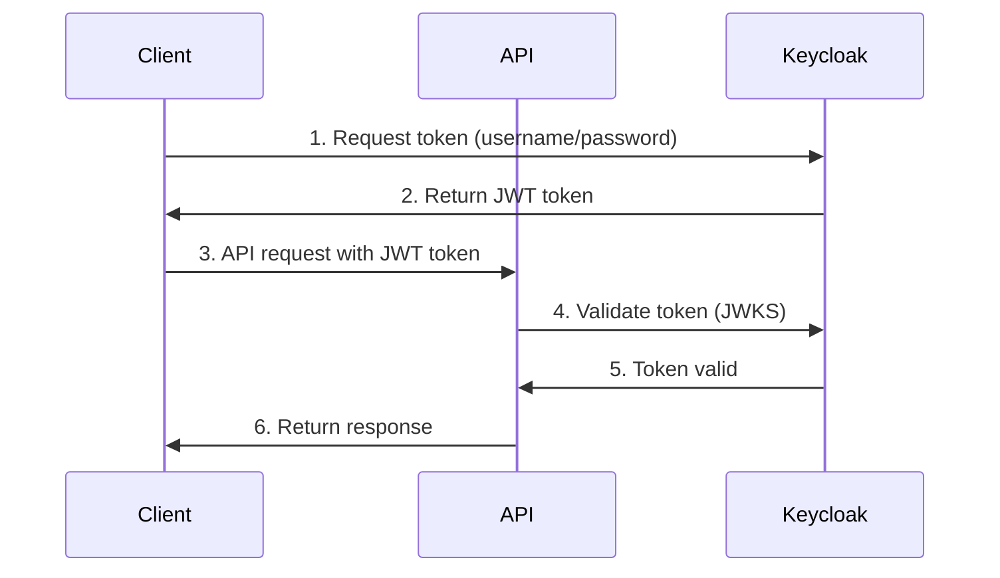

# Overview

The Authentication Test API is a modern, secure RESTful API server designed to demonstrate best practices for building enterprise-grade Java applications with OAuth 2.0 authentication.

## What is Authentication Test API?

This API provides a simple yet complete example of:

- **Secure Authentication** - OAuth 2.0 with JWT tokens via Keycloak
- **Role-Based Authorization** - Fine-grained access control
- **RESTful Design** - Clean, predictable API endpoints
- **Enterprise Standards** - Jakarta EE 10 and MicroProfile 6.1
- **Cloud-Native** - Containerized deployment with OpenLiberty

## Use Cases

The Authentication Test API is ideal for:

- **Learning** - Understanding OAuth 2.0 and JWT authentication
- **Prototyping** - Quick start for new secure API projects
- **Reference** - Best practices for Java enterprise applications
- **Testing** - Validating authentication and authorization flows

## Core Concepts

### Authentication Flow

### Key Components

#### 1. OpenLiberty Server
Lightweight, cloud-native Java application server that provides:
- Fast startup times
- Small memory footprint
- Full Jakarta EE and MicroProfile support

#### 2. Keycloak
Open-source Identity and Access Management solution providing:
- OAuth 2.0 and OpenID Connect
- User management
- Role-based access control
- Token management

#### 3. MicroProfile JWT
Specification for using JWT tokens in microservices:
- Token validation
- Claims extraction
- Role mapping

## API Structure

### Base Path
All API endpoints are prefixed with `/api/v1`

### Endpoints

| Endpoint | Method | Auth Required | Description |
|----------|--------|---------------|-------------|
| `/api/v1/hello` | GET | No | Health check |
| `/api/v1/schedule` | GET | Yes | User schedule |

### Authentication

Protected endpoints require:
1. Valid JWT token in `Authorization` header
2. Token format: `Bearer <token>`
3. Required role: `schedule-user`

## Security Model

### Token-Based Authentication
- JWT tokens issued by Keycloak
- Tokens contain user identity and roles
- Tokens are cryptographically signed
- API validates signature using Keycloak's public key

### Role-Based Authorization
- Users must have `schedule-user` role
- Roles are checked on each request
- Missing roles result in 403 Forbidden

## Next Steps

1. [Check Prerequisites](prerequisites.md) - Ensure you have required tools
2. [Quick Start](quick-start.md) - Get the API running
3. [Build with Maven](../build/maven.md) - Learn the build process
4. [Setup Keycloak](../keycloak/realm-setup.md) - Configure authentication